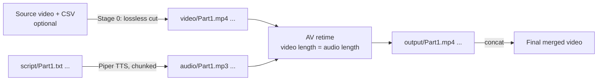

<div align="center">

# audio-video-sync-pipeline

**Scripts in, narrated video out.** Offline text-to-speech, automatic video retiming, and a final merge, all running in parallel.


-orange)


</div>

---

## In plain words

You have a long video split into parts, and a text script for each part. This tool:

1. turns each script into a voice-over (MP3) using an **offline** voice engine,
2. stretches or shrinks each video part so it lasts exactly as long as its voice-over,
3. joins every part into one finished video.

Nothing is uploaded anywhere. **No account, no API key, and no internet connection are needed.**

## Pipeline



## Features

- **Parallel workers.** Text-to-speech and video retiming run on separate thread pools (default 2 each, adjustable in the UI or with environment variables).
- **Long-text friendly.** Scripts are split into chunks of up to 240 characters for stable speech, then joined into one MP3 (96 kbps mono).
- **Automatic retiming.** Each video's speed is scaled by `audio_duration / video_duration`, so picture and voice end together.
- **GPU when available.** Uses NVIDIA NVENC (`h264_nvenc`) if your FFmpeg supports it. Falls back to `libx264` on the CPU automatically.
- **Resume-safe.** Existing good files are skipped. Files are written to temporary names and renamed only when complete. Failed parts are re-queued on a timer.
- **Optional pre-cut (Stage 0).** Drop in a big source video plus a CSV of start/end times and the tool cuts it into `Part1.mp4`, `Part2.mp4`, … without re-encoding.
- **Live log.** See every stage in the window.

## Requirements

| Tool | Needed for | Required? |
|---|---|---|
| Python 3.10 or newer | Running the app | Yes |
| [FFmpeg](https://ffmpeg.org/download.html) and `ffprobe` on your `PATH` | Cutting, retiming, merging | Yes |
| [Piper](https://github.com/rhasspy/piper) plus at least one voice model | Text-to-speech | Yes |
| NVIDIA GPU with NVENC | Faster encoding | No |

Tkinter ships with Python on Windows and macOS. On Linux install it with `sudo apt install python3-tk`.

### Keys and accounts

**None.** This project is fully local.

## Install

```bash
git clone https://github.com/saumitratambe/audio-video-sync-pipeline.git
cd audio-video-sync-pipeline
python -m venv .venv
# Windows:  .venv\Scripts\activate
# macOS/Linux:  source .venv/bin/activate
pip install -r requirements.txt
```

### Piper setup

1. Download Piper for your OS.
2. Create a folder named `piper` **next to `saturday.py`** and unzip Piper into it. The executable must be `piper/piper.exe` (Windows) or `piper/piper` (macOS/Linux).
3. Copy at least one voice into the same folder: `<voice>.onnx` and `<voice>.onnx.json`.
4. Start the app and click **Refresh** next to the model list.

If you have several voices, the app picks one with `ryan` in its name by default, otherwise the first one it finds. You can change it in the dropdown. Use the **speaker** box for multi-speaker voices.

## Prepare your project folder

Create one **root folder** per video. The app creates the sub-folders it needs.

```text
my-video/                  <- select this in the app
├── script/                <- YOU add: Part1.txt, Part2.txt, ...
├── video/                 <- YOU add: Part1.mp4, Part2.mp4, ... (or let Stage 0 create them)
├── audio/                 <- created: Part1.mp3 ...
├── output/                <- created: Part1.mp4 ... (synced parts)
└── my-video.mp4           <- created: final merged video
```

**Rule:** a script and its video must share the same base name (`Part1.txt` ↔ `Part1.mp4`).

### Optional: let Stage 0 cut the video for you

Put these two files in the root folder instead of a `video/` folder full of parts:

- one big source video (`.mp4`, `.mkv`, `.mov`, or `.avi`),
- one `.csv` file with a **start** and **end** time on each line, in `HH:MM:SS`:

```csv
00:00:00,00:04:12
00:04:12,00:09:40
00:09:40,00:15:03
```

The tool checks that no end time is longer than the video, then cuts the parts in parallel. Cuts use stream copy, so they are instant and lossless, but they snap to the nearest keyframe.

The included helper `transcript-to-losslesscut-csv.py` builds this CSV (and the `script/PartN.txt` files) from a timestamped transcript.

## How to use

1. Run `python saturday.py`.
2. Click **Browse…** and select your root folder.
3. Choose the Piper model (and speaker, if needed).
4. Set the worker counts if you want (default 2 and 2).
5. Click **Start**. Watch the log. When all parts are done, the final video is created in the root folder.
6. Stopped or crashed? Start again. Finished parts are skipped.

## Settings

Set these as environment variables before you start the app.

| Variable | Default | Meaning |
|---|---|---|
| `CHUNK_LIMIT` | `240` | Max characters per speech chunk |
| `SCAN_INTERVAL_SEC` | `2.0` | How often the app rescans for new files |
| `TTS_MAX_WORKERS` | `2` | Parallel speech jobs |
| `AV_MAX_WORKERS` | `2` | Parallel retiming jobs |
| `GOOD_MP4_B` | `51200` | Minimum size in bytes for an output MP4 to count as valid |

```bash
# Windows PowerShell
$env:TTS_MAX_WORKERS = "4"; python saturday.py
# macOS / Linux
TTS_MAX_WORKERS=4 python saturday.py
```

## Extra tools in this folder

| File | What it does |
|---|---|
| `transcript-to-losslesscut-csv.py` | Reads a timestamped transcript. Writes the cut CSV, one script file per part, and an optional `parts.zip`. |
| `merge.py` | Stand-alone lossless video merger (FFmpeg concat) with a simple GUI. |

## Troubleshooting

| Problem | Fix |
|---|---|
| "FFmpeg missing" | Install FFmpeg and add it to your `PATH`. |
| "No models found in ./piper" | Add `.onnx` (and `.onnx.json`) files to the `piper` folder and click **Refresh**. |
| "CSV max end time exceeds source duration" | A time in your CSV is longer than the video. Fix the CSV. |
| Video is too fast or slow | Retiming matches the picture to the voice. Long voice-over on a short clip slows the clip. Cut clips closer to the length you need. |
| Output is tiny or missing | Check the log for the FFmpeg error. The app already retries with the CPU encoder if NVENC fails. |

## Known limitations

- The source video's original audio is dropped on purpose. Only the generated voice is used.
- Very large speed changes look unnatural. This tool matches lengths. It does not do smart scene selection.
- The main script is named `saturday.py` for historical reasons.

## Contributing

Issues and pull requests are welcome. Ideas: a command-line mode, subtitle export, and unit tests for the time parsing helpers.

## License

MIT. See `LICENSE`. Copyright © Saumitra Tambe.
